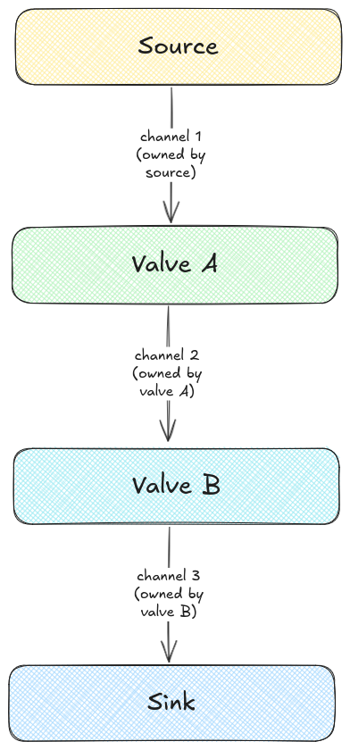

# pipe

General purpose pure-Go in-memory data streaming library that relies on simple, powerful IO interfaces to support piping data from one or more sources to one or more sinks, as well as arbitrary chains of intermediate custom transformations. Performance factors such as concurrency and buffering are entirely user-tunable.

## A note on piping

In this library, regions of data flow out of a `pipe.Source` into a `pipe.Sink`, and optionally through a sequence of `pipe.Valve`(s). Each component is connected to the next component in the pipe via a channel.

This illustration shows an example of a `pipe.Pipe` with two `pipe.Valve`s, where one channel links each pair of components.



Each upstream component is responsible for closing the downstream channel it owns before exiting, in order to signal to the next component that there will be no more data sent to the channel. So in this example, when `Source` is finished writing data to channel 1, `Source` should close channel 1; when `Valve A` is finished writing data to channel 2, `Valve A` should close channel 2; and when `Valve B` is finished writing data to channel 3, `Valve B` should close channel 3.

In order to hook up all the components together properly, pipes are constructed in reverse, starting at the sink and working backwards / upstream to the source. After creating the channel directly upstream of the sink (i.e. the last channel in the sequence), that channel can be passed as the sink to the previous component in the chain. If the next component up is a valve (rather than the source), we'll pass the channel to it to write data to, and in turn, the valve will return the channel it will read data from.

The connector code is [here](github.com/naylorpmax-joyent/blob/main/pipe.go#L121-L136), and if we "unroll" the iteration through the components for this example, the process looks like something like this: 

```python
# here's our pipe
pipe = [source, a, b, sink]

# the sink doesn't write to anything, as it's the last step in the chain
ch3_sink_in = sink.build()

# pass the sink's input channel as valve B's output channel
ch2_b_in = b.build(out=ch3_sink_in)

# pass valve B's input channel as valve A's output channel
ch1_a_in = a.build(out=ch2_b_in)

# pass valve A's input channel as the source's output channel
source.build(out=ch1_a_in)

# the source doesn't have an input channel, so we're done!
```